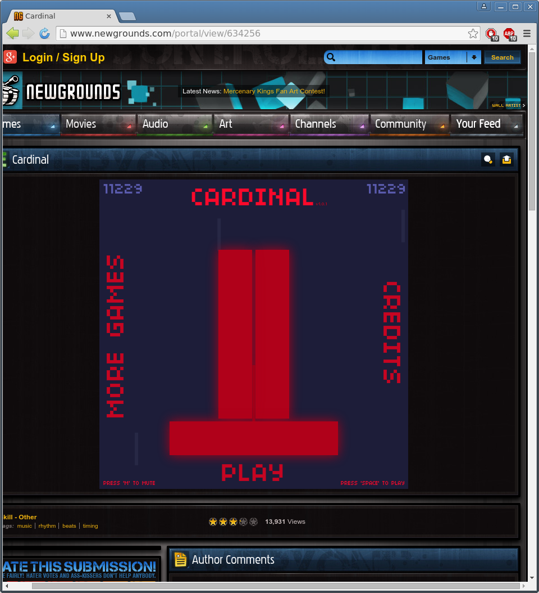

# Bot Cardinal 

## About

This Python script is a bot able to play the Flash game
[Cardinal](http://www.newgrounds.com/portal/view/634256) by taking
screenshots and inputting mouse and keyboard actions. It is widely
inspired from the technique described in the article
[Programming a Bot to Play the "Sushi Go Round" Flash Game](http://inventwithpython.com/blog/2014/12/17/programming-a-bot-to-play-the-sushi-go-round-flash-game/).

There are two versions of the bot. The first one only involves Python
scripting using the
[pyautogui](https://github.com/asweigart/pyautogui/) module. However
this version of the program is too slow at taking screenshot and can't
keep up with the game speed beyond the 80 score mark. The second
version of the bot uses a custom C API for taking screenshots, based
on the X11 library. This version is able to take screenshots as fast
as the game framerate. It seems __this second bot seems to be able to
play the game indefinetely without losing__. I have only waited until it
reaches the 11k+ score mark though...



## Usage

The Python only version is located inside the `Python` directory. The
optimised Python and C version can be found inside the `C` directory,
along with a Makefile for building the C API as a shared library.

In order test the scripts, you need to have an opened and visible
window of the _Cardinal_ game running. Then just launch the script
from the command line and wait:

```
python3 cardinalbot.py
```

To interrupt the script, you can Ctrl+C or move the mouse far in the
upper-left corner.
